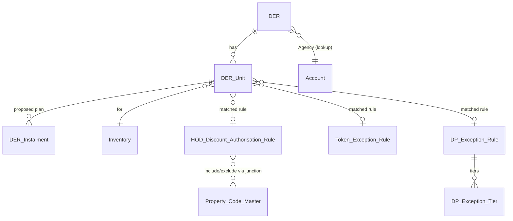

> **DRAFT — pending Technical/Architecture sign-off.** This document is derived directly from the BRD referenced below. Sections marked **[Open]** require confirmation from Business/Sales Admin before build starts.

# Technical Design Document
## Configuration of HOD Discount Authorisation in Salesforce & DER Sanity Checks

| | |
|---|---|
| **Demand Ref** | MID OFFICE/2026/38020 |
| **Source BRD** | HOD Discount Authorisation & DER Sanity Checks – BRD, v1.3 (Final), 02 Jul 2026 |
| **Platform** | Salesforce |
| **Prepared By** | Claude (Technical Design), on behalf of Salesforce Engineering (Udaya Katragadda / Deepak Kansal) |
| **Business Owner** | Saugato Dey (Sales Admin) |
| **Business POC** | Deepesh Moolchandani |
| **Document Status** | Draft v0.1 |
| **Date** | 17 July 2026 |

---

## 1. Purpose

This document translates the business requirements in the BRD (Demand Ref MID OFFICE/2026/38020) into a Salesforce technical design: data model, automation (Flow/Apex), validation logic, security model, and rollout approach for:

- **Module A** — DER hygiene & sanity checks performed at the point of raising a DER.
- **Module B** — Configurable HOD Discount Authorisation Matrix (with Token Exception and Down Payment Exception sub-tables) that drives DER auto-approval.

It assumes the `DER` object and its current manual MIS-review approval process already exist in the org. This design **extends** that object model rather than replacing it, so that manually-approved DERs continue to work exactly as today.

## 2. Design Principles

1. **Configuration over code.** Rule matrices (Module B) live in custom objects maintained through standard Salesforce list views / related lists, not a bespoke UI, per the BRD's stated preference.
2. **Auto-approval must fail closed.** Any ambiguity, missing data, or unmatched rule routes the DER to the existing manual approval path — never to auto-approval by default.
3. **No partial approval.** A DER is a single unit of approval; if it contains multiple inventory units, every unit must independently qualify for the DER to be auto-approved (BR-B3).
4. **Auditability.** Every auto-approval decision, and every matrix change, must be traceable to the rule/record that produced it (maker, checker, timestamps, matched rule reference).
5. **Bulk-safe automation.** All triggers/Flows must handle multi-unit DERs and bulk data operations without hitting governor limits (bulkified Apex, no per-record DML/SOQL in loops).

---

## 3. Solution Architecture Overview

```mermaid
flowchart TD
    RM[RM raises DER] --> A1[Module A: Hygiene & Sanity Checks\n(Flow + validation rules)]
    A1 -- fails --> Block[Blocked: inline errors,\nDER not saved/submitted]
    A1 -- passes --> Submit[DER Submitted]
    Submit --> Engine[Apex: DERAutoApprovalEngine]
    Engine --> Matrix[(HOD Discount\nAuthorisation Rule)]
    Engine --> Token[(Token Exception\nRule)]
    Engine --> DP[(DP Exception\nRule + Tiers)]
    Engine -- all units match,\nwithin authority --> Auto[Status = Auto-Approved]
    Engine -- any unit fails\nany check --> Manual[Status = Pending Approval\n(existing MIS approval process, unchanged)]
    Matrix -.maker-checker.-> MakerChecker[Sales Ops (Maker) →\nSales Admin HOD (Checker)]
```

**Key components:**

| Layer | Technology | Rationale |
|---|---|---|
| Field-level hygiene validation | Validation Rules + Screen Flow (before submit) | Immediate, in-context feedback to RM; no code needed for simple checks |
| Cross-object / cross-record checks (ID match, ACD, payment plan sum, agency comment consistency) | Record-Triggered Flow calling an Apex **InvocableMethod**, or pure Apex on submit action | Needs SOQL joins and text parsing beyond native Flow comfort; kept in one testable Apex service |
| Auto-approval decision engine | Apex class `DERAutoApprovalEngine` (bulkified, invoked from Screen Flow "Submit DER" button) | Rule matching involves multi-select include/exclude sets, range comparisons, and per-unit aggregation — not practical in declarative Flow alone at scale |
| Matrix configuration & versioning | Custom objects + native list views/related lists | Meets "standard screens, minimal custom UI" |
| Maker–checker | Native Salesforce **Approval Process** on the rule objects | No custom code; built-in audit trail (ProcessInstance/ProcessInstanceHistory) |
| Config that must change without deployment (separators, document-type-by-country map, agency-mismatch keywords) | **Custom Metadata Types** | Deployable via change sets but editable in Setup without a release for value tweaks |

---

## 4. Data Model

### 4.1 Object Relationship Diagram



### 4.2 New / Extended Fields on `DER__c` (header)

| Field API Name | Type | Purpose | BR |
|---|---|---|---|
| `Agency__c` | Lookup(Account) *(existing, assumed)* | Source for derived Agency Type | A3 |
| `Agency_Type__c` | Formula (Text, read-only) `= Agency__r.Agency_Category__c` | Derived, read-only Agency Type shown on DER | A3 |
| `Agency_Comment_Validation_Status__c` | Picklist: `Not Checked / Consistent / Inconsistent` | Result of comment-vs-agency-type check | A3 |
| `Free_Text_Comment__c` | Long Text Area | Optional additional notes, not case-specific | A4 |
| `Auto_Approval_Status__c` | Picklist: `Not Evaluated / Auto-Approved / Manual Review Required` | Outcome of the engine | B3 |
| `Auto_Approval_Reason__c` | Long Text Area (read-only) | Human-readable reasons per unit when routed to manual review | B3 |
| `Auto_Approved_Date__c` | Date/Time | Set when engine auto-approves | B3 |
| `Submitted_Date__c` | Date/Time | Existing/standard submission timestamp | — |

### 4.3 New Object: `DER_Unit__c` (child of DER — one per inventory unit on the DER)

| Field API Name | Type | Purpose | BR |
|---|---|---|---|
| `DER__c` | Master-Detail(DER__c) | Parent DER | — |
| `Inventory__c` | Lookup(Inventory) | Unit being transacted | A5 / B3 |
| `Country__c` | Formula/Lookup rollup from Inventory | Rule-matching key | B3 |
| `Construction_Status__c` | Formula/rollup from Inventory: `Ready / Off-Plan` | Rule-matching key | B3 |
| `Inventory_Type__c` | Formula/rollup from Inventory: `Townhouse/Apartment/Office/Retail` | Rule-matching key | B3 |
| `Bedroom_Type__c` | Formula/rollup from Inventory | Rule-matching key | B3 |
| `Property_Code__c` | Formula/rollup from Inventory | Rule-matching key | B3 |
| `Unit_Price__c` | Currency (rollup from Inventory or deal price) | Rule-matching key | B3 |
| `ID_Document_Type__c` | Picklist: `Passport / National ID`, defaulted by `Country__c` via Custom Metadata | Which document type is mandatory | A1/A2 |
| `Applicant_Name__c` / `Applicant_Name_OCR__c` | Text / Text (read-only) | RM-entered vs OCR-extracted name | A1 |
| `ID_Number_RM__c` | Text (editable) | RM-entered / corrected ID number | A1 |
| `ID_Number_OCR__c` | Text (read-only) | Original OCR-extracted ID number, preserved even if RM edits | A1 |
| `Nationality__c` / `Nationality_OCR__c` | Text / Text (read-only) | RM-entered vs OCR-extracted nationality | A1 |
| `Identity_Match_Status__c` | Picklist: `Matched / Mismatch / Not Verified` (system-set) | Result of A1 comparison | A1 |
| `Identity_Document_Attached__c` | Checkbox (formula on ContentDocumentLink count) | Blocks submit if false | A2 |
| `Identity_Document_Type_Verified__c` | Picklist: `Not Verified / Verified / Verification Failed` | Result of document-type classification | A2 |
| `Token_Exception_Selection__c` | Picklist (defined values) | Structured selection | A4 |
| `Rebate_Selection__c` | Picklist, single value **`34%`** only | Structured selection, hard-restricted | A4 |
| `DLD_Waiver_Selection__c` | Picklist (defined % values) | Structured selection | A4 |
| `Discount_Selection__c` | Picklist (defined % values) | Structured selection | A4 |
| `System_Generated_Comment__c` | Long Text Area (read-only) | Auto-built from the four selections above | A4 |
| `Combined_Comment__c` | Long Text Area (read-only) | `System_Generated_Comment__c` + static separator + `Free_Text_Comment__c` (unit-level) | A4 |
| `ACD_Validation_Status__c` | Picklist: `Pass / Fail` (system-set) | A5 check #1 result | A5 |
| `Payment_Plan_Match_Status__c` | Picklist: `Pass / Fail` (system-set) | A5 check #2 result | A5 |
| `Requested_Authority_Percent__c` | Formula: `DLD_Waiver% + Rebate% + Discount%` | Compared against matched rule's ceiling | B2 |
| `Matched_HOD_Rule__c` | Lookup(HOD_Discount_Authorisation_Rule__c) | Audit trail of which rule matched (if any) | B3 |
| `Matched_Token_Rule__c` | Lookup(Token_Exception_Rule__c) | Audit trail | B5 |
| `Matched_DP_Rule__c` | Lookup(DP_Exception_Rule__c) | Audit trail | B2 |
| `Unit_Auto_Approval_Eligible__c` | Checkbox (system-set) | Per-unit pass/fail feeding DER-level rollup | B3 |

### 4.4 New Object: `DER_Instalment__c` (child of `DER_Unit__c`)

| Field API Name | Type | Purpose |
|---|---|---|
| `DER_Unit__c` | Master-Detail | Parent unit |
| `Instalment_Date__c` | Date | Proposed instalment date — must not exceed `Inventory.ACD__c` |
| `Instalment_Percent__c` | Percent | Proposed instalment % |
| `Instalment_Type__c` | Picklist: `Booking / DP / Regular / Handover` | Used to isolate "DP-related instalments" for the DP Exception check |

*(Assumes the actual/target payment plan already exists as child records on `Inventory__c`, e.g. `Inventory_Payment_Plan_Instalment__c`, reused read-only for the comparison in A5.)*

### 4.5 New Object: `HOD_Discount_Authorisation_Rule__c`

| Field API Name | Type | Notes |
|---|---|---|
| `Name` | Auto-number `HOD-RULE-{0000}` | |
| `Deal_Type__c` | Picklist: `Direct / Corporate Agency / Individual Agency` | 4.1 |
| `Country__c` | Picklist (extensible) | 4.1 |
| `Construction_Status__c` | Picklist: `Ready / Off-Plan` | 4.1 |
| `Inventory_Type__c` | Picklist: `Townhouse / Apartment / Office / Retail` | 4.1 |
| `Bedroom_Type_Include__c` | Multi-Select Picklist | Empty = no inclusion restriction |
| `Bedroom_Type_Exclude__c` | Multi-Select Picklist | Evaluated first; exclusion always wins |
| `Property_Code_Include__c` / `Property_Code_Exclude__c` | See §4.6 (junction object recommended over multi-select) | |
| `Price_Min__c` / `Price_Max__c` | Currency | Inclusive range |
| `Max_Authority_Percent__c` | Percent | Ceiling on `DLD Waiver + Rebate + Discount` |
| `Combination_Allowed__c` | Multi-Select Picklist: `DLD Waiver / Rebate / Discount` | Which levers this rule permits at all |
| `Priority__c` | Number | Tie-breaker if a unit matches >1 active rule — lowest number wins **[Open: confirm tie-break policy with Business]** |
| `Start_Date__c` / `End_Date__c` | Date | Date-bound versioning |
| `Status__c` | Picklist: `Draft / Pending Checker Approval / Active / Rejected / Closed` | Driven by Approval Process |
| `Maker__c` | Lookup(User), defaults to creator | Sales Ops |
| `Checker__c` | Lookup(User), populated on approval | Sales Admin HOD |
| `Checker_Approved_Date__c` | Date/Time | |
| `Superseded_By__c` | Lookup(self) | Links closed rule to its replacement, preserving history |

### 4.6 Property Code Include/Exclude — design choice

Salesforce multi-select picklists cap at ~500 values and don't scale well as the property portfolio grows. Recommended approach: a **junction object** `HOD_Rule_Property_Code__c` (`Rule__c` lookup, `Property_Code__c` lookup to the existing Property/Building master, `Inclusion_Type__c` picklist `Include/Exclude`), surfaced as a **standard related list** on the rule record page — still zero custom UI, but scalable. Multi-select picklist remains fine for `Bedroom_Type__c` since that value set is small and stable.

### 4.7 New Object: `Token_Exception_Rule__c`

| Field | Type | Notes |
|---|---|---|
| `Min_Token_Percent__c` | Percent | Default `5%` (full token) |
| `Balance_Token_Days__c` | Number | Days allowed to complete balance token |
| `Start_Date__c` / `End_Date__c` / `Status__c` / `Maker__c` / `Checker__c` | Same pattern as §4.5 | Same maker-checker + versioning model |

**[Open]**: BRD does not specify whether Token Exception rules are keyed by the same rule-matching parameters as the Discount Matrix (deal type/country/etc.) or apply globally. Design assumes global-with-date-bound-versioning unless Business confirms otherwise; adding the same key fields as §4.5 is a low-effort extension if needed.

### 4.8 New Objects: `DP_Exception_Rule__c` + `DP_Exception_Tier__c`

`DP_Exception_Rule__c`: same date-bound/maker-checker header as §4.7.

`DP_Exception_Tier__c` (child, one rule → many tiers, e.g. "A% in X days", "B% in Y days", "24% (outer limit) in Z days"):

| Field | Type | Notes |
|---|---|---|
| `DP_Exception_Rule__c` | Master-Detail | |
| `Tier_Order__c` | Number | Sort order |
| `Min_DP_Percent__c` | Percent | Threshold this tier applies from |
| `Max_Days__c` | Number | Max days from booking to complete DP at this threshold |

### 4.9 Custom Metadata Types (config, not data)

| CMDT | Purpose |
|---|---|
| `DER_Config__mdt` | Static separator string for `Combined_Comment__c`; other tunables |
| `Country_Identity_Document__mdt` | Maps `Country__c → Required Document Type` (Passport for UAE, National ID for Iraq, extensible for future geographies) |
| `Agency_Mismatch_Keyword__mdt` | Keyword/phrase → Agency Type it contradicts, used by the BR-A3 comment-consistency check, editable without a deployment |

---

## 5. Module A — Detailed Design

### BR-A1 — Identity Match

- OCR extraction is an existing integration (per BRD); this design only adds storage/comparison, not the OCR service itself.
- On document upload, the existing OCR callout populates `Applicant_Name_OCR__c`, `ID_Number_OCR__c`, `Nationality_OCR__c` (all read-only, never overwritten by RM edits).
- RM-facing fields (`Applicant_Name__c`, `ID_Number_RM__c`, `Nationality__c`) are editable; keeping OCR and RM values in separate fields lets Sales Ops attribute a mismatch to *OCR misread* vs *RM edit* per the BRD's explicit ask.
- A Record-Triggered Flow (before save on `DER_Unit__c`) sets `Identity_Match_Status__c = 'Matched'` when RM fields equal OCR fields (case/format-insensitive compare), else `'Mismatch'`.
- **Submission gate:** block submit while `Identity_Match_Status__c = 'Mismatch'` **unless** RM has entered a value into `ID_Number_RM__c` that differs from OCR (i.e., an explicit correction is allowed — the block is on *unexplained* mismatch, not on RM override). **[Open: confirm with Business/IT whether an unexplained mismatch should hard-block or only warn, pending OCR accuracy fix.]**
- Dependency: OCR accuracy issue (5–10% ID-number miss rate) called out in the BRD as a pre-go-live blocker owned by IT — tracked as an external dependency, not solved by this design.

### BR-A2 — Mandatory Identity Document + Type Verification

- `Identity_Document_Attached__c` — roll-up/formula off `ContentDocumentLink` count filtered by a `Document_Type__c` tag on the file (requires files to be tagged at upload, e.g., via a Screen Flow file-upload step that captures document type).
- Document **type verification** (passport vs. national ID, not just "a file exists") reuses the same document-classification capability as the OCR step, writing `Identity_Document_Type_Verified__c`.
- Required type is looked up via `Country_Identity_Document__mdt` keyed on `DER_Unit__c.Country__c`.
- Submit is blocked (validation rule / Flow fault path) unless `Identity_Document_Attached__c = true` AND `Identity_Document_Type_Verified__c = 'Verified'`.

### BR-A3 — Agency Type Derivation & Comment Consistency

- `Agency_Type__c` is a formula field on `DER__c`, `= Agency__r.Agency_Category__c` (reuses existing Account field, read-only by construction — no extra enforcement needed).
- Comment-consistency check (Flow, before submit): if `Agency__c` is blank → block with "Select an agency before submitting." If populated, scan the RM comment field(s) for keywords from `Agency_Mismatch_Keyword__mdt` that contradict the derived `Agency_Type__c` (e.g., "direct deal" present while `Agency_Type__c ≠ Direct`) → set `Agency_Comment_Validation_Status__c = 'Inconsistent'` and show a blocking pop-up (Screen Flow) asking the RM to correct the comment before proceeding, per BRD wording ("block the RM from proceeding... until the comments are corrected").
- Keyword list lives in Custom Metadata so Sales Ops can tune it without a deployment.

### BR-A4 — Structured Selections Replace Free Text

- Four picklists on `DER_Unit__c`: `Token_Exception_Selection__c`, `Rebate_Selection__c` (single allowed value `34%`, enforced by picklist value set — not free text, so no validation rule needed), `DLD_Waiver_Selection__c`, `Discount_Selection__c`.
- Before-save Flow builds `System_Generated_Comment__c` by concatenating only the non-blank selections, e.g. `"DLD waiver = 4%; Discount = 2%"`.
- `Combined_Comment__c = System_Generated_Comment__c + <separator from DER_Config__mdt> + Free_Text_Comment__c`, computed at unit level as specified. Separator kept in metadata (e.g. `" || "`) so its format can change without a release.
- `Free_Text_Comment__c` remains available on every DER (not case-gated), consistent with the BRD.

### BR-A5 — Instalment vs. ACD & Payment-Plan Summation

- Before-submit Apex (`InstalmentValidationService`, bulkified across all `DER_Instalment__c` for all units on the DER):
  1. **ACD check:** for each instalment, `Instalment_Date__c <= Inventory__r.ACD__c`. Any breach → `ACD_Validation_Status__c = 'Fail'` on the unit, with the specific offending date(s) surfaced in the error message.
  2. **Sum check:** `SUM(DER_Instalment__c.Instalment_Percent__c)` for the unit must equal `SUM(Inventory_Payment_Plan_Instalment__c.Percent__c)` for the same inventory, within a small rounding tolerance (e.g. ±0.01%) to absorb floating-point rounding — exact tolerance to be confirmed with Finance.
  3. Both must pass for the unit to be submittable; failures are shown inline against the payment-plan grid, not as a generic error.

---

## 6. Module B — Detailed Design

### 6.1 Auto-Approval Engine (`DERAutoApprovalEngine`, Apex)

Invoked once per DER submission (bulk-safe: accepts a `Set<Id>` of DER Ids so multiple DERs submitted in the same transaction/batch are handled in one pass).

```
for each DER submitted:
    allUnitsEligible = true
    for each DER_Unit on this DER:
        rule = findBestMatchingDiscountRule(unit)          // §6.2
        if rule == null OR unit.Requested_Authority_Percent__c > rule.Max_Authority_Percent__c:
            unit.Unit_Auto_Approval_Eligible__c = false
            log reason
            allUnitsEligible = false
            continue

        if unit.Token_Exception_Selection__c is set:
            tokenRule = findActiveTokenRule(today)
            if tokenRule == null OR NOT tokenSatisfies(unit, tokenRule):
                unit.Unit_Auto_Approval_Eligible__c = false
                allUnitsEligible = false
                continue

        dpInstalments = unit.DER_Instalment__c where Instalment_Type__c = 'DP'
        if dpInstalments is not empty:
            dpRule = findActiveDPRule(today)
            totalDP = SUM(dpInstalments.Instalment_Percent__c)
            allowedDays = tierFor(dpRule, totalDP).Max_Days__c
            actualDays = MAX(dpInstalments.Instalment_Date__c - DER.Booking_Date__c)
            if dpRule == null OR actualDays > allowedDays:
                unit.Unit_Auto_Approval_Eligible__c = false
                allUnitsEligible = false
                continue

        unit.Unit_Auto_Approval_Eligible__c = true
        unit.Matched_HOD_Rule__c = rule.Id

    DER.Auto_Approval_Status__c = allUnitsEligible ? 'Auto-Approved' : 'Manual Review Required'
    if allUnitsEligible:
        DER.Auto_Approved_Date__c = now
        DER.Status__c = 'Approved'
    else:
        DER.Status__c = 'Pending Approval'   // existing manual MIS flow, unchanged
```

No partial approval: the DER-level outcome is the AND of every unit's outcome, per BR-B3.

### 6.2 Rule Matching (`findBestMatchingDiscountRule`)

```
candidates = SOQL:
    SELECT ... FROM HOD_Discount_Authorisation_Rule__c
    WHERE Status__c = 'Active'
      AND Start_Date__c <= :today AND End_Date__c >= :today
      AND Deal_Type__c = :der.Deal_Type__c
      AND Country__c = :unit.Country__c
      AND Construction_Status__c = :unit.Construction_Status__c
      AND Inventory_Type__c = :unit.Inventory_Type__c
      AND Price_Min__c <= :unit.Unit_Price__c
      AND Price_Max__c >= :unit.Unit_Price__c
    ORDER BY Priority__c ASC

for each candidate (in priority order):
    if unit.Bedroom_Type__c in candidate.Bedroom_Type_Exclude__c: continue
    if candidate.Bedroom_Type_Include__c is not empty
       and unit.Bedroom_Type__c not in candidate.Bedroom_Type_Include__c: continue
    if unit.Property_Code__c in candidate.excludedPropertyCodes: continue
    if candidate.includedPropertyCodes is not empty
       and unit.Property_Code__c not in candidate.includedPropertyCodes: continue
    return candidate     // first match wins, by Priority__c

return null   // no match → manual review
```

Exclusion is always evaluated before inclusion, so an explicit exclude always wins even if a broader include would otherwise match — matches the BRD's sample rules (e.g., exclude Property DDB/DDA, exclude Studio, within an otherwise-matching Apartments/Off-Plan/1–2MN rule).

### 6.3 Maker–Checker (native Approval Process, no custom code)

- Standard **Approval Process** on `HOD_Discount_Authorisation_Rule__c` (and identically on `Token_Exception_Rule__c` / `DP_Exception_Rule__c`):
  - Entry criteria: `Status__c = 'Draft'`.
  - Submitter (Maker): Sales Ops (enforced via a Permission Set granting create/edit on the rule objects while in Draft).
  - Approver (Checker): assigned to a Public Group `Sales_Admin_HOD_Checkers` containing Deepesh Moolchandani / Yasir (or whoever holds the Sales Admin HOD role at the time — group membership, not hardcoded users, so turnover doesn't require a deployment).
  - Field updates on submit: `Status__c → 'Pending Checker Approval'`, record locked for edit (standard approval-process record-lock behaviour).
  - On approve: `Status__c → 'Active'` if `Start_Date__c <= TODAY`, else remains scheduled and a small daily Scheduled Flow flips `Status__c → 'Active'` on the `Start_Date__c` (and → `'Closed'` past `End_Date__c`).
  - On reject: `Status__c → 'Draft'`, unlocked, rejection comments visible to Maker via standard approval history related list.
- **Versioning ("promotion-style"):** editing an in-force rule is disallowed once `Active` (record lock). To change terms, Sales Ops uses a **Clone** action that pre-fills a new Draft from the existing rule, sets the old rule's `End_Date__c = new Start_Date__c - 1` and `Status__c = 'Closed'` on activation of the new one, and stamps `Superseded_By__c`. This preserves full history for audit, per BR-B2.
- Field History Tracking enabled on all rule/tier objects' key fields (dates, percentages, status) as an additional audit layer beyond the approval history.

### 6.4 Token Exception (BR-B5) & DP Exception (§4.8/6.1)

Both follow the identical rule-object pattern in §6.3 (own object, own Approval Process, same maker/checker group) — implemented as configuration of the same underlying pattern rather than bespoke logic, keeping the three matrices (Discount, Token, DP) operationally consistent for Sales Ops.

---

## 7. Security Model

| Persona | Object Access | Notes |
|---|---|---|
| RM (Sales) | `DER__c`, `DER_Unit__c`, `DER_Instalment__c` — CRU on own/team records | No access to rule objects |
| Sales Ops (Maker) | `HOD_Discount_Authorisation_Rule__c`, `Token_Exception_Rule__c`, `DP_Exception_Rule__c` (+ tiers, + property-code junction) — Create/Edit while `Status__c = 'Draft'` only (enforced by record lock post-submit) | Cannot self-approve — Submit for Approval requires a different user (standard approval-process behaviour when submitter ≠ approver) |
| Sales Admin HOD (Checker) | Approve/Reject on the same objects via standard approval actions; Read on all statuses | Membership of `Sales_Admin_HOD_Checkers` group drives this, not per-user permission edits |
| MIS / current manual approvers | Unchanged — continue to see and act on any DER routed to `'Pending Approval'` | No change to their existing permissions |
| System Administrator | Full access, CMDT edit rights | |

Sharing on `HOD_Discount_Authorisation_Rule__c` etc.: Org-wide default **Private** with the Approval Process granting the Checker group access automatically, plus a sharing rule giving all Sales Ops Read access (they need to see active rules even if they didn't author them).

---

## 8. Non-Functional Requirements

- **Bulk-safety:** `DERAutoApprovalEngine` and `InstalmentValidationService` must handle a DER with an arbitrary number of units/instalments in a single pass (bulkified SOQL/DML), and multiple DERs submitted in the same context (e.g., API bulk load) without exceeding governor limits.
- **Idempotency:** Re-running the engine on a DER already `Auto-Approved` must be a no-op (guarded by status check) — relevant if a scheduled/batch re-evaluation is ever introduced.
- **Auditability:** Every auto-approval decision must be reconstructable after the fact from `Matched_HOD_Rule__c` / `Matched_Token_Rule__c` / `Matched_DP_Rule__c` and `Auto_Approval_Reason__c`, even after the matching rule is later closed/superseded (lookups, not text copies, so the historical rule record remains inspectable).
- **Performance:** Rule-matching SOQL must be selective — index/filter on `Status__c`, `Start_Date__c`, `End_Date__c` first (custom indexes if the rule table grows large) before applying in-memory include/exclude filtering.
- **Data migration:** Existing in-flight DERs at go-live are **not** retroactively evaluated by the engine; only DERs submitted after go-live use auto-approval. **[Open: confirm cut-over handling with Business.]**

---

## 9. Rollout Considerations

- Recommend a **phased rollout by Country and/or Deal Type** rather than a big-bang switch — e.g., enable auto-approval for UAE Corporate Agency deals first, expand once OCR accuracy and rule coverage are validated in production. This is naturally supported by the design: if no active rule exists for a given Country/Deal Type combination, every DER in that segment simply falls through to manual review with zero extra configuration.
- Module A hygiene checks should go live **ahead of** Module B auto-approval, since the BRD explicitly frames hygiene as the precondition for safely removing manual review ("hygiene checks must be foolproof, as auto-approved DERs receive no manual review").
- UAT must include the OCR-accuracy sample cases called out in the BRD (the 5–10% ID-number mismatch cohort) before Module B goes live.

---

## 10. Assumptions, Dependencies & Open Items

| # | Item | Type |
|---|---|---|
| 1 | `DER__c` and its existing manual approval process already exist and are unchanged by this design except where explicitly extended. | Assumption |
| 2 | OCR extraction service already exists and is reused as-is; this design only consumes its output. OCR accuracy fix is an IT-owned dependency outside this design's scope. | Dependency |
| 3 | `Account.Agency_Category__c` is the source of truth for Agency Type (per BRD). | Assumption |
| 4 | Whether an identity mismatch (BR-A1) hard-blocks submission or only warns pending OCR fix. | **Open — needs Business decision** |
| 5 | Whether Token Exception rules key off the same Deal Type/Country/etc. parameters as the Discount Matrix, or are global. | **Open — needs Business decision** |
| 6 | Tie-break policy when a unit matches more than one active, non-overlapping-on-paper-but-actually-overlapping rule. | **Open — needs Business decision on `Priority__c` semantics, or a hard constraint that active rules must not overlap** |
| 7 | Rounding tolerance for the payment-plan summation check (BR-A5). | **Open — needs Finance confirmation** |
| 8 | Handling of in-flight DERs at go-live (retroactive evaluation vs. forward-only). | **Open — needs Business decision** |

---

## 11. Traceability Matrix (BRD → Technical Component)

| BR | Requirement | Technical Component(s) |
|---|---|---|
| A1 | Identity match (name/ID/nationality vs. document) | `DER_Unit__c` OCR/RM field pairs, `Identity_Match_Status__c`, before-save Flow |
| A2 | Mandatory identity document + type verification | `Identity_Document_Attached__c`, `Identity_Document_Type_Verified__c`, `Country_Identity_Document__mdt` |
| A3 | Agency Type derivation & comment consistency | `Agency_Type__c` formula, `Agency_Mismatch_Keyword__mdt`, blocking Screen Flow |
| A4 | Structured selections replacing free text | 4 picklists, `System_Generated_Comment__c`, `Combined_Comment__c`, `DER_Config__mdt` separator |
| A5 | Instalment vs. ACD + payment-plan sum | `InstalmentValidationService` (Apex), `ACD_Validation_Status__c`, `Payment_Plan_Match_Status__c` |
| B1 | Configurable matrix, multi-select bedroom/property | `HOD_Discount_Authorisation_Rule__c`, `HOD_Rule_Property_Code__c` junction |
| B2 | Date-bound versioning + Max Authority ceiling + DP exception table | `Start_Date__c`/`End_Date__c`/`Status__c`/`Superseded_By__c`, `Requested_Authority_Percent__c`, `DP_Exception_Rule__c`/`Tier__c` |
| B3 | Auto-approval logic, no partial approval | `DERAutoApprovalEngine`, per-unit `Unit_Auto_Approval_Eligible__c`, DER-level AND rollup |
| B4 | Maker–checker | Native Approval Process on rule objects, `Sales_Admin_HOD_Checkers` group |
| B5 | Token exception table | `Token_Exception_Rule__c`, same Approval Process pattern |

---

## 12. Open Questions for Business / Architecture Sign-off

1. Confirm hard-block vs. warn-only behaviour for BR-A1 identity mismatches until OCR accuracy is fixed.
2. Confirm whether Token Exception rules need the same segmentation (Country/Deal Type/etc.) as the Discount Matrix.
3. Confirm overlap policy for HOD Discount rules (should the system prevent overlapping active rules at save time, or rely on `Priority__c`?).
4. Confirm rounding tolerance for payment-plan summation.
5. Confirm treatment of DERs already in flight at go-live.
6. Confirm current/target Public Group membership for Checkers (Deepesh / Yasir + any deputy/backup approver for continuity).
