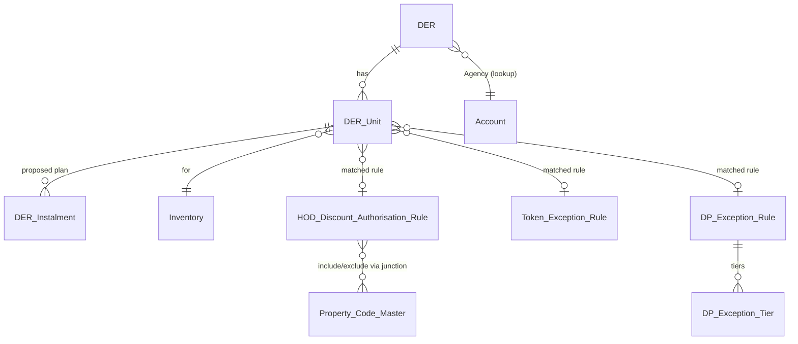

> **Status: Draft, pending Technical and Architecture sign-off.** This document has been prepared on the basis of the Business Requirements Document referenced below. Sections designated as **Open Items** require formal confirmation from Business and Sales Admin prior to the commencement of build activity.

# Technical Design Document
## Configuration of HOD Discount Authorisation in Salesforce and DER Sanity Checks

| | |
|---|---|
| **Demand Reference** | MID OFFICE/2026/38020 |
| **Source Document** | HOD Discount Authorisation & DER Sanity Checks – Business Requirements Document, Version 1.3 (Final), dated 02 July 2026 |
| **Platform** | Salesforce |
| **Prepared By** | Salesforce Technical Design Team, on behalf of Salesforce Engineering (Udaya Katragadda / Deepak Kansal) |
| **Business Owner** | Mr. Saugato Dey, Sales Admin |
| **Business Point of Contact** | Mr. Deepesh Moolchandani |
| **Document Status** | Draft, Version 0.1 |
| **Date of Issue** | 17 July 2026 |

---

## 1. Purpose

The purpose of this document is to set out the technical design by which the business requirements contained in the Business Requirements Document (Demand Reference MID OFFICE/2026/38020) shall be realised within the Salesforce platform. This design addresses the data model, automation architecture (Flow and Apex), validation logic, security model, and rollout approach for the following two modules:

- **Module A** — DER hygiene and sanity checks, to be performed at the point at which a DER is raised.
- **Module B** — A configurable HOD Discount Authorisation Matrix, comprising Token Exception and Down Payment Exception sub-tables, governing the auto-approval of a DER.

This design proceeds on the basis that the `DER` object and the existing manual MIS-review approval process are already present within the organisation. Accordingly, this design **extends** the existing object model rather than replacing it, such that DERs continuing to require manual approval shall be unaffected by this change.

## 2. Design Principles

The following principles have been applied throughout this design and should guide any subsequent implementation or change:

1. **Configuration in preference to code.** The rule matrices comprising Module B shall reside in custom objects maintained through standard Salesforce list views and related lists, rather than a bespoke user interface, in accordance with the preference stated in the Business Requirements Document.
2. **Auto-approval shall fail closed.** Any ambiguity, absence of required data, or failure to match an applicable rule shall result in the DER being routed to the existing manual approval process; auto-approval shall never be granted by default.
3. **Partial approval shall not be permitted.** A DER constitutes a single unit of approval. Where a DER comprises multiple inventory units, each such unit must independently satisfy the applicable criteria in order for the DER as a whole to be auto-approved, in accordance with BR-B3.
4. **Auditability shall be maintained at all times.** Every auto-approval decision, and every amendment to the authorisation matrix, shall be traceable to the record and user responsible (maker, checker, timestamp, and the specific rule matched).
5. **Automation shall be bulk-safe.** All triggers and Flows shall be designed to accommodate multi-unit DERs and bulk data operations without exceeding Salesforce governor limits, through the use of bulkified Apex and the avoidance of DML or SOQL operations within loops.

---

## 3. Solution Architecture Overview

```mermaid
flowchart TD
    RM[RM raises DER] --> A1[Module A: Hygiene & Sanity Checks\n(Flow + validation rules)]
    A1 -- fails --> Block[Blocked: inline errors,\nDER not saved/submitted]
    A1 -- passes --> Submit[DER Submitted]
    Submit --> Engine[Apex: DERAutoApprovalEngine]
    Engine --> Matrix[(HOD Discount\nAuthorisation Rule)]
    Engine --> Token[(Token Exception\nRule)]
    Engine --> DP[(DP Exception\nRule + Tiers)]
    Engine -- all units match,\nwithin authority --> Auto[Status = Auto-Approved]
    Engine -- any unit fails\nany check --> Manual[Status = Pending Approval\n(existing MIS approval process, unchanged)]
    Matrix -.maker-checker.-> MakerChecker[Sales Ops (Maker) →\nSales Admin HOD (Checker)]
```

**Principal architectural components:**

| Layer | Technology | Rationale |
|---|---|---|
| Field-level hygiene validation | Validation Rules and a Screen Flow, executed prior to submission | Provides immediate, in-context feedback to the Relationship Manager; declarative configuration is sufficient for checks of this nature |
| Cross-object and cross-record checks (identity match, ACD, payment-plan summation, agency-comment consistency) | Record-Triggered Flow invoking an Apex Invocable Method, or Apex executed directly on the submission action | These checks require SOQL joins and text evaluation beyond the practical capability of native Flow, and are accordingly consolidated within a single, testable Apex service |
| Auto-approval decision engine | Apex class `DERAutoApprovalEngine`, bulkified and invoked from the "Submit DER" Screen Flow | Rule matching requires evaluation of multi-select inclusion and exclusion sets, numeric range comparisons, and per-unit aggregation, which is not practicable within declarative Flow at the required scale |
| Matrix configuration and versioning | Custom objects, administered through native list views and related lists | Satisfies the Business Requirements Document's stated preference for standard screens and minimal custom user interface |
| Maker–checker control | Native Salesforce Approval Process, applied to the rule objects | Requires no custom development and provides an inherent audit trail via ProcessInstance and ProcessInstanceHistory |
| Configuration values requiring amendment without a deployment (separators, document-type-by-country mapping, agency-mismatch keywords) | Custom Metadata Types | Deployable through standard change-set procedures, while remaining editable in Setup for minor value changes without requiring a release |

---

## 4. Data Model

### 4.1 Object Relationship Diagram



### 4.2 New and Extended Fields on `DER__c` (Header Record)

| Field API Name | Type | Purpose | Business Requirement |
|---|---|---|---|
| `Agency__c` | Lookup (Account), assumed pre-existing | Source field for the derived Agency Type | A3 |
| `Agency_Type__c` | Formula, Text, read-only: `= Agency__r.Agency_Category__c` | Derived, read-only Agency Type presented on the DER | A3 |
| `Agency_Comment_Validation_Status__c` | Picklist: Not Checked / Consistent / Inconsistent | Result of the comment-to-agency-type consistency check | A3 |
| `Free_Text_Comment__c` | Long Text Area | Optional supplementary notes, applicable to all DERs | A4 |
| `Auto_Approval_Status__c` | Picklist: Not Evaluated / Auto-Approved / Manual Review Required | Outcome determined by the auto-approval engine | B3 |
| `Auto_Approval_Reason__c` | Long Text Area, read-only | Narrative explanation, per unit, where the DER has been routed to manual review | B3 |
| `Auto_Approved_Date__c` | Date/Time | Populated upon auto-approval | B3 |
| `Submitted_Date__c` | Date/Time | Existing standard submission timestamp | — |

### 4.3 New Object: `DER_Unit__c` (Child of DER; One Record per Inventory Unit)

| Field API Name | Type | Purpose | Business Requirement |
|---|---|---|---|
| `DER__c` | Master-Detail (`DER__c`) | Parent DER | — |
| `Inventory__c` | Lookup (Inventory) | The inventory unit to which the DER relates | A5 / B3 |
| `Country__c` | Formula or rollup from Inventory | Rule-matching parameter | B3 |
| `Construction_Status__c` | Formula or rollup from Inventory: Ready / Off-Plan | Rule-matching parameter | B3 |
| `Inventory_Type__c` | Formula or rollup from Inventory: Townhouse / Apartment / Office / Retail | Rule-matching parameter | B3 |
| `Bedroom_Type__c` | Formula or rollup from Inventory | Rule-matching parameter | B3 |
| `Property_Code__c` | Formula or rollup from Inventory | Rule-matching parameter | B3 |
| `Unit_Price__c` | Currency, rollup from Inventory or deal price | Rule-matching parameter | B3 |
| `ID_Document_Type__c` | Picklist: Passport / National ID, defaulted by `Country__c` via Custom Metadata | Determines the identity document mandated for the unit | A1 / A2 |
| `Applicant_Name__c` / `Applicant_Name_OCR__c` | Text / Text, read-only | Relationship Manager-entered name, and OCR-extracted name, respectively | A1 |
| `ID_Number_RM__c` | Text, editable | Relationship Manager-entered or corrected identity number | A1 |
| `ID_Number_OCR__c` | Text, read-only | Original OCR-extracted identity number, retained irrespective of subsequent edits | A1 |
| `Nationality__c` / `Nationality_OCR__c` | Text / Text, read-only | Relationship Manager-entered nationality, and OCR-extracted nationality, respectively | A1 |
| `Identity_Match_Status__c` | Picklist: Matched / Mismatch / Not Verified, system-populated | Outcome of the identity comparison under BR-A1 | A1 |
| `Identity_Document_Attached__c` | Checkbox, formula on ContentDocumentLink count | Prevents submission where no document is attached | A2 |
| `Identity_Document_Type_Verified__c` | Picklist: Not Verified / Verified / Verification Failed | Outcome of document-type classification | A2 |
| `Token_Exception_Selection__c` | Picklist, defined values | Structured selection | A4 |
| `Rebate_Selection__c` | Picklist, restricted to the single permissible value of 34% | Structured selection, restricted by design | A4 |
| `DLD_Waiver_Selection__c` | Picklist, defined percentage values | Structured selection | A4 |
| `Discount_Selection__c` | Picklist, defined percentage values | Structured selection | A4 |
| `System_Generated_Comment__c` | Long Text Area, read-only | Automatically constructed from the four selections identified above | A4 |
| `Combined_Comment__c` | Long Text Area, read-only | Concatenation, at unit level, of `System_Generated_Comment__c`, a static separator, and `Free_Text_Comment__c` | A4 |
| `ACD_Validation_Status__c` | Picklist: Pass / Fail, system-populated | Result of the first validation described under BR-A5 | A5 |
| `Payment_Plan_Match_Status__c` | Picklist: Pass / Fail, system-populated | Result of the second validation described under BR-A5 | A5 |
| `Requested_Authority_Percent__c` | Formula: DLD Waiver % + Rebate % + Discount % | Compared against the ceiling defined by the matched rule | B2 |
| `Matched_HOD_Rule__c` | Lookup (`HOD_Discount_Authorisation_Rule__c`) | Retained for audit purposes to indicate the rule matched, if any | B3 |
| `Matched_Token_Rule__c` | Lookup (`Token_Exception_Rule__c`) | Retained for audit purposes | B5 |
| `Matched_DP_Rule__c` | Lookup (`DP_Exception_Rule__c`) | Retained for audit purposes | B2 |
| `Unit_Auto_Approval_Eligible__c` | Checkbox, system-populated | Per-unit outcome, contributing to the DER-level determination | B3 |

### 4.4 New Object: `DER_Instalment__c` (Child of `DER_Unit__c`)

| Field API Name | Type | Purpose |
|---|---|---|
| `DER_Unit__c` | Master-Detail | Parent unit |
| `Instalment_Date__c` | Date | Proposed instalment date, which shall not exceed `Inventory.ACD__c` |
| `Instalment_Percent__c` | Percent | Proposed instalment percentage |
| `Instalment_Type__c` | Picklist: Booking / DP / Regular / Handover | Used to identify down-payment-related instalments for the purposes of the DP Exception check |

*This design assumes that the actual, or target, payment plan already exists as child records of `Inventory__c` (for example, `Inventory_Payment_Plan_Instalment__c`), and that these records shall be reused on a read-only basis for the comparison required under BR-A5.*

### 4.5 New Object: `HOD_Discount_Authorisation_Rule__c`

| Field API Name | Type | Notes |
|---|---|---|
| `Name` | Auto-number, format `HOD-RULE-{0000}` | |
| `Deal_Type__c` | Picklist: Direct / Corporate Agency / Individual Agency | Refer to Section 4.1 of the Business Requirements Document |
| `Country__c` | Picklist, extensible | Refer to Section 4.1 of the Business Requirements Document |
| `Construction_Status__c` | Picklist: Ready / Off-Plan | Refer to Section 4.1 of the Business Requirements Document |
| `Inventory_Type__c` | Picklist: Townhouse / Apartment / Office / Retail | Refer to Section 4.1 of the Business Requirements Document |
| `Bedroom_Type_Include__c` | Multi-Select Picklist | An empty value denotes the absence of an inclusion restriction |
| `Bedroom_Type_Exclude__c` | Multi-Select Picklist | Evaluated in the first instance; an exclusion shall take precedence in all cases |
| `Property_Code_Include__c` / `Property_Code_Exclude__c` | Refer to Section 4.6; a junction object is recommended in preference to a multi-select field | |
| `Price_Min__c` / `Price_Max__c` | Currency | Inclusive range |
| `Max_Authority_Percent__c` | Percent | Ceiling applicable to the combined DLD Waiver, Rebate, and Discount | 
| `Combination_Allowed__c` | Multi-Select Picklist: DLD Waiver / Rebate / Discount | Specifies which levers this rule permits |
| `Priority__c` | Number | Serves as a tie-breaker where a given unit satisfies more than one active rule; the lowest value shall prevail. **Open Item: the tie-break policy requires confirmation by Business.** |
| `Start_Date__c` / `End_Date__c` | Date | Governs date-bound versioning |
| `Status__c` | Picklist: Draft / Pending Checker Approval / Active / Rejected / Closed | Governed by the Approval Process |
| `Maker__c` | Lookup (User), defaulted to the record creator | Sales Ops |
| `Checker__c` | Lookup (User), populated upon approval | Sales Admin HOD |
| `Checker_Approved_Date__c` | Date/Time | |
| `Superseded_By__c` | Lookup (self-referencing) | Links a closed rule to its replacement, in order to preserve historical record |

### 4.6 Property Code Inclusion and Exclusion — Design Determination

Salesforce multi-select picklists are subject to a practical ceiling of approximately five hundred values and are not well suited to a property portfolio expected to grow over time. It is accordingly recommended that a **junction object**, `HOD_Rule_Property_Code__c`, be employed in its place, comprising a lookup to the rule (`Rule__c`), a lookup to the existing Property or Building master (`Property_Code__c`), and an inclusion-type picklist (`Inclusion_Type__c`: Include / Exclude). This junction object shall be presented as a standard related list on the rule record page, thereby continuing to require no custom user interface while remaining scalable. The `Bedroom_Type__c` field, by contrast, may reasonably remain a multi-select picklist, as its value set is limited and unlikely to change.

### 4.7 New Object: `Token_Exception_Rule__c`

| Field | Type | Notes |
|---|---|---|
| `Min_Token_Percent__c` | Percent | Default value of 5% (full token) |
| `Balance_Token_Days__c` | Number | Number of days permitted for completion of the balance token |
| `Start_Date__c` / `End_Date__c` / `Status__c` / `Maker__c` / `Checker__c` | Consistent with Section 4.5 | Governed by the same maker–checker and versioning model |

**Open Item:** The Business Requirements Document does not specify whether Token Exception rules are to be governed by the same rule-matching parameters as the Discount Matrix (deal type, country, and so forth) or are to apply on a global basis. This design proceeds on the assumption that such rules shall be global and date-bound unless Business advises otherwise; the addition of equivalent key fields, as set out in Section 4.5, may be incorporated as a limited extension should this prove necessary.

### 4.8 New Objects: `DP_Exception_Rule__c` and `DP_Exception_Tier__c`

`DP_Exception_Rule__c` shall carry the same date-bound and maker–checker header fields as described in Section 4.7.

`DP_Exception_Tier__c` shall exist as a child object, such that a single rule may comprise multiple tiers (for example, "A% within X days", "B% within Y days", and "24% (outer limit) within Z days"):

| Field | Type | Notes |
|---|---|---|
| `DP_Exception_Rule__c` | Master-Detail | |
| `Tier_Order__c` | Number | Determines sort order |
| `Min_DP_Percent__c` | Percent | Threshold from which this tier shall apply |
| `Max_Days__c` | Number | Maximum number of days, from booking, within which the down payment must be completed at this threshold |

### 4.9 Custom Metadata Types (Configuration, as Distinct from Transactional Data)

| Custom Metadata Type | Purpose |
|---|---|
| `DER_Config__mdt` | Holds the static separator string employed within `Combined_Comment__c`, together with other configurable values |
| `Country_Identity_Document__mdt` | Maps each `Country__c` value to its required identity document type (Passport for the United Arab Emirates, National Identity Document for Iraq, and extensible to future geographies) |
| `Agency_Mismatch_Keyword__mdt` | Maps keywords or phrases to the Agency Type each is understood to contradict, for the purposes of the BR-A3 comment-consistency check, and is editable without requiring a deployment |

---

## 5. Module A — Detailed Design

### BR-A1 — Identity Match

- OCR extraction is understood to be an existing integration, as described in the Business Requirements Document; this design accordingly addresses only the storage and comparison of the extracted data, and not the OCR service itself.
- Upon upload of the relevant document, the existing OCR process shall populate `Applicant_Name_OCR__c`, `ID_Number_OCR__c`, and `Nationality_OCR__c`, each of which shall remain read-only and shall not be overwritten by any subsequent Relationship Manager edit.
- The corresponding Relationship Manager-facing fields (`Applicant_Name__c`, `ID_Number_RM__c`, `Nationality__c`) shall remain editable. The retention of the OCR-derived and Relationship Manager-entered values in separate fields shall enable Sales Ops to attribute any discrepancy either to an OCR misread or to a Relationship Manager correction, in accordance with the express requirement of the Business Requirements Document.
- A record-triggered Flow, executed prior to save on `DER_Unit__c`, shall set `Identity_Match_Status__c` to "Matched" where the Relationship Manager-entered fields correspond to the OCR-extracted fields (subject to a case- and format-insensitive comparison), and to "Mismatch" otherwise.
- **Submission control:** Submission shall be blocked while `Identity_Match_Status__c` remains "Mismatch", save where the Relationship Manager has entered a value into `ID_Number_RM__c` that differs from the OCR-extracted value, thereby constituting an explicit correction. Accordingly, the control is directed at an unexplained mismatch, and not at a deliberate Relationship Manager override. **Open Item: it is to be confirmed with Business and Information Technology whether an unexplained mismatch should result in a hard block or a warning only, pending resolution of the OCR accuracy issue.**
- **Dependency:** The OCR accuracy issue, resulting in an identity-number discrepancy rate of approximately five to ten per cent as noted in the Business Requirements Document, is recorded as a pre-go-live blocker owned by Information Technology. This issue constitutes an external dependency and does not fall within the scope of this design.

### BR-A2 — Mandatory Identity Document and Type Verification

- `Identity_Document_Attached__c` shall be derived, by way of a roll-up or formula, from the count of `ContentDocumentLink` records filtered by a `Document_Type__c` tag applied to the file. This shall require that files be tagged with their document type at the point of upload, for instance through a file-upload step within a Screen Flow.
- Verification of document **type** — that is, confirmation that the attached file is specifically a passport or national identity document, as applicable, rather than mere confirmation that a file has been attached — shall reuse the document-classification capability already employed for the OCR step, and shall record its outcome in `Identity_Document_Type_Verified__c`.
- The document type required in a given case shall be determined by reference to `Country_Identity_Document__mdt`, keyed on `DER_Unit__c.Country__c`.
- Submission shall be prevented, by way of a validation rule or Flow fault path, unless `Identity_Document_Attached__c` equals true and `Identity_Document_Type_Verified__c` equals "Verified".

### BR-A3 — Agency Type Derivation and Comment Consistency

- `Agency_Type__c` shall be implemented as a formula field on `DER__c`, defined as `= Agency__r.Agency_Category__c`, thereby reusing the existing Account field and remaining read-only by construction, without requiring further enforcement.
- The comment-consistency check shall be implemented as a Flow executed prior to submission. Where `Agency__c` is blank, submission shall be blocked with the message "Please select an agency before submitting." Where `Agency__c` is populated, the Relationship Manager comment field shall be examined for keywords held in `Agency_Mismatch_Keyword__mdt` that contradict the derived `Agency_Type__c` (for example, the phrase "direct deal" appearing where `Agency_Type__c` does not equal "Direct"). Where such a contradiction is identified, `Agency_Comment_Validation_Status__c` shall be set to "Inconsistent", and a blocking pop-up, presented by way of a Screen Flow, shall require the Relationship Manager to amend the comment before proceeding, in accordance with the requirement of the Business Requirements Document that the Relationship Manager be prevented from proceeding until the comments are corrected.
- The keyword list shall be maintained in Custom Metadata, such that it may be amended by Sales Ops without requiring a deployment.

### BR-A4 — Structured Selections in Place of Free Text

- Four picklist fields shall be introduced on `DER_Unit__c`: `Token_Exception_Selection__c`, `Rebate_Selection__c` (restricted to the single permissible value of 34% through the picklist value set, thereby requiring no separate validation rule), `DLD_Waiver_Selection__c`, and `Discount_Selection__c`.
- A Flow executed prior to save shall construct `System_Generated_Comment__c` by concatenating only those selections which are not blank, in the form: "DLD waiver = 4%; Discount = 2%".
- `Combined_Comment__c` shall be constructed as `System_Generated_Comment__c`, followed by the separator held in `DER_Config__mdt`, followed by `Free_Text_Comment__c`, computed at unit level as specified. The separator (for example, " || ") shall be held in metadata such that its format may be amended without a release.
- `Free_Text_Comment__c` shall remain available on every DER, and shall not be restricted to particular cases, consistent with the Business Requirements Document.

### BR-A5 — Instalment Date Against ACD, and Payment-Plan Summation

- A pre-submission Apex service, `InstalmentValidationService`, bulkified across all `DER_Instalment__c` records for all units on the DER, shall perform the following:
  1. **ACD validation:** Each instalment date shall be verified as not exceeding `Inventory__r.ACD__c`. Any breach shall result in `ACD_Validation_Status__c` being set to "Fail" against the relevant unit, with the specific offending date or dates identified in the resulting error message.
  2. **Summation validation:** The sum of `DER_Instalment__c.Instalment_Percent__c` for the unit shall be required to equal the sum of `Inventory_Payment_Plan_Instalment__c.Percent__c` for the corresponding inventory, subject to a small rounding tolerance (for example, ±0.01%) to accommodate floating-point rounding; the precise tolerance is to be confirmed with Finance.
  3. Both validations must be satisfied for the unit to be submittable. Any failure shall be presented inline against the payment-plan grid, rather than as a generic error message.

---

## 6. Module B — Detailed Design

### 6.1 Auto-Approval Engine (`DERAutoApprovalEngine`, Apex)

This engine shall be invoked once per DER submission and shall be bulk-safe, accepting a `Set<Id>` of DER identifiers such that multiple DERs submitted within the same transaction or batch are processed within a single pass.

```
for each DER submitted:
    allUnitsEligible = true
    for each DER_Unit on this DER:
        rule = findBestMatchingDiscountRule(unit)          // Section 6.2
        if rule == null OR unit.Requested_Authority_Percent__c > rule.Max_Authority_Percent__c:
            unit.Unit_Auto_Approval_Eligible__c = false
            log reason
            allUnitsEligible = false
            continue

        if unit.Token_Exception_Selection__c is set:
            tokenRule = findActiveTokenRule(today)
            if tokenRule == null OR NOT tokenSatisfies(unit, tokenRule):
                unit.Unit_Auto_Approval_Eligible__c = false
                allUnitsEligible = false
                continue

        dpInstalments = unit.DER_Instalment__c where Instalment_Type__c = 'DP'
        if dpInstalments is not empty:
            dpRule = findActiveDPRule(today)
            totalDP = SUM(dpInstalments.Instalment_Percent__c)
            allowedDays = tierFor(dpRule, totalDP).Max_Days__c
            actualDays = MAX(dpInstalments.Instalment_Date__c - DER.Booking_Date__c)
            if dpRule == null OR actualDays > allowedDays:
                unit.Unit_Auto_Approval_Eligible__c = false
                allUnitsEligible = false
                continue

        unit.Unit_Auto_Approval_Eligible__c = true
        unit.Matched_HOD_Rule__c = rule.Id

    DER.Auto_Approval_Status__c = allUnitsEligible ? 'Auto-Approved' : 'Manual Review Required'
    if allUnitsEligible:
        DER.Auto_Approved_Date__c = now
        DER.Status__c = 'Approved'
    else:
        DER.Status__c = 'Pending Approval'   // existing manual MIS process, unchanged
```

Partial approval shall not occur under any circumstance: the DER-level outcome shall be the logical conjunction (AND) of the outcome of every constituent unit, in accordance with BR-B3.

### 6.2 Rule Matching (`findBestMatchingDiscountRule`)

```
candidates = SOQL:
    SELECT ... FROM HOD_Discount_Authorisation_Rule__c
    WHERE Status__c = 'Active'
      AND Start_Date__c <= :today AND End_Date__c >= :today
      AND Deal_Type__c = :der.Deal_Type__c
      AND Country__c = :unit.Country__c
      AND Construction_Status__c = :unit.Construction_Status__c
      AND Inventory_Type__c = :unit.Inventory_Type__c
      AND Price_Min__c <= :unit.Unit_Price__c
      AND Price_Max__c >= :unit.Unit_Price__c
    ORDER BY Priority__c ASC

for each candidate (in priority order):
    if unit.Bedroom_Type__c in candidate.Bedroom_Type_Exclude__c: continue
    if candidate.Bedroom_Type_Include__c is not empty
       and unit.Bedroom_Type__c not in candidate.Bedroom_Type_Include__c: continue
    if unit.Property_Code__c in candidate.excludedPropertyCodes: continue
    if candidate.includedPropertyCodes is not empty
       and unit.Property_Code__c not in candidate.includedPropertyCodes: continue
    return candidate     // first match, in priority order, shall be selected

return null   // absence of a match shall result in manual review
```

Exclusion criteria shall in every instance be evaluated in advance of inclusion criteria, such that an explicit exclusion shall prevail even where a broader inclusion criterion would otherwise be satisfied. This is consistent with the sample rules provided in the Business Requirements Document, whereby Property Codes DDB and DDA, and the Studio bedroom type, are excluded from an otherwise-matching Apartments, Off-Plan, AED 1–2 million rule.

### 6.3 Maker–Checker Control (Native Approval Process; No Custom Development Required)

- A standard Salesforce Approval Process shall be configured on `HOD_Discount_Authorisation_Rule__c`, and correspondingly on `Token_Exception_Rule__c` and `DP_Exception_Rule__c`:
  - **Entry criteria:** `Status__c` equals "Draft".
  - **Submitter (Maker):** Sales Ops, such access being enforced through a Permission Set granting create and edit rights on the rule objects while in Draft status.
  - **Approver (Checker):** Assigned to the Public Group `Sales_Admin_HOD_Checkers`, presently comprising Mr. Deepesh Moolchandani and Mr. Yasir, or such other individual as may from time to time hold the role of Sales Admin HOD. Approval shall be governed by group membership rather than by named user, such that a change in personnel shall not require a deployment.
  - **Upon submission:** `Status__c` shall be updated to "Pending Checker Approval", and the record shall be locked for editing, in accordance with standard Approval Process behaviour.
  - **Upon approval:** `Status__c` shall be updated to "Active" where `Start_Date__c` is on or before the present date; otherwise, the rule shall remain scheduled, and a daily Scheduled Flow shall update `Status__c` to "Active" upon the arrival of `Start_Date__c" (and correspondingly to "Closed" following `End_Date__c`).
  - **Upon rejection:** `Status__c` shall revert to "Draft", the record shall be unlocked, and the rejection comments shall be made available to the Maker by way of the standard Approval History related list.
- **Versioning (a "promotion" model):** Amendment of a rule that is presently Active shall not be permitted, the record being locked accordingly. Where terms are to be changed, Sales Ops shall employ a Clone action to pre-populate a new Draft record from the existing rule. Upon activation of the new rule, the preceding rule's `End_Date__c` shall be set to the day immediately preceding the new rule's `Start_Date__c`, its `Status__c` shall be set to "Closed", and `Superseded_By__c` shall be populated accordingly. This mechanism shall ensure that a complete historical record is preserved for audit purposes, in accordance with BR-B2.
- Field History Tracking shall be enabled in respect of the key fields (dates, percentages, and status) of all rule and tier objects, providing a further layer of audit beyond that furnished by the Approval Process itself.

### 6.4 Token Exception (BR-B5) and Down Payment Exception (Sections 4.8 and 6.1)

Both mechanisms shall follow the identical rule-object pattern described in Section 6.3, each comprising its own object and its own Approval Process, administered by the same maker–checker group. This approach implements the three matrices — Discount, Token, and Down Payment — as configurations of a single underlying pattern, rather than as bespoke logic, thereby ensuring operational consistency for Sales Ops.

---

## 7. Security Model

| Persona | Object Access | Notes |
|---|---|---|
| Relationship Manager (Sales) | `DER__c`, `DER_Unit__c`, `DER_Instalment__c` — Create, Read, and Update on own or team records | No access shall be granted to the rule objects |
| Sales Ops (Maker) | `HOD_Discount_Authorisation_Rule__c`, `Token_Exception_Rule__c`, `DP_Exception_Rule__c`, together with the associated tier and property-code junction objects — Create and Edit while `Status__c` equals "Draft" only, such access being withdrawn by record lock upon submission | Self-approval shall not be possible, as submission for approval requires a user other than the submitter, consistent with standard Approval Process behaviour |
| Sales Admin HOD (Checker) | Approve or Reject the same objects by way of standard approval actions; Read access across all statuses | Access shall be governed by membership of the `Sales_Admin_HOD_Checkers` group, rather than by individual permission assignment |
| MIS and existing manual approvers | Unaffected by this design; such users shall continue to view and act upon any DER routed to "Pending Approval" | No change shall be made to their existing permissions |
| System Administrator | Full access, including the right to amend Custom Metadata Type records | |

The organisation-wide default sharing setting for `HOD_Discount_Authorisation_Rule__c` and the associated objects shall be set to Private, with access granted to the Checker group automatically through the Approval Process, and a sharing rule additionally granting Read access to all Sales Ops users, such that active rules may be viewed even by those who did not author them.

---

## 8. Non-Functional Requirements

- **Bulk safety.** `DERAutoApprovalEngine` and `InstalmentValidationService` shall be capable of processing a DER comprising any number of units or instalments within a single execution pass (through bulkified SOQL and DML), and of processing multiple DERs submitted within the same context (for instance, by way of a bulk API load) without exceeding Salesforce governor limits.
- **Idempotency.** Re-execution of the engine against a DER already bearing the status "Auto-Approved" shall constitute a no-operation, such behaviour being enforced by a status guard; this requirement is of particular relevance should a scheduled or batch re-evaluation process be introduced at a later date.
- **Auditability.** Every auto-approval decision shall be capable of reconstruction, after the event, by reference to `Matched_HOD_Rule__c`, `Matched_Token_Rule__c`, `Matched_DP_Rule__c`, and `Auto_Approval_Reason__c`, notwithstanding that the matched rule may subsequently have been closed or superseded, this being achieved through the use of record lookups rather than copied text, such that the historical rule record remains available for inspection.
- **Performance.** The rule-matching SOQL query shall be constructed so as to be selective, filtering in the first instance on `Status__c`, `Start_Date__c`, and `End_Date__c` (with custom indexes to be applied should the volume of rule records grow substantially) prior to the application of in-memory inclusion and exclusion filtering.
- **Data migration.** DERs already in progress at the point of go-live shall not be retroactively evaluated by the engine; auto-approval shall apply only to DERs submitted following go-live. **Open Item: the treatment of the cut-over is to be confirmed with Business.**

---

## 9. Rollout Considerations

- It is recommended that rollout proceed in **phases, by Country and/or Deal Type**, rather than by way of a single, simultaneous transition. By way of example, auto-approval might first be enabled for United Arab Emirates Corporate Agency deals, with subsequent expansion following validation of OCR accuracy and rule coverage in the production environment. This approach is inherently supported by the design: in the absence of an active rule for a given Country and Deal Type combination, every DER within that segment shall, without further configuration, be routed to manual review.
- The Module A hygiene checks should be brought into production **in advance of** Module B auto-approval, as the Business Requirements Document expressly identifies such hygiene checks as a precondition for the safe removal of manual review, given that auto-approved DERs shall not thereafter be subject to manual review.
- User Acceptance Testing must include the OCR-accuracy sample cases identified in the Business Requirements Document (namely, the cohort exhibiting an identity-number mismatch rate of approximately five to ten per cent) prior to Module B being brought into production.

---

## 10. Assumptions, Dependencies, and Open Items

| No. | Item | Category |
|---|---|---|
| 1 | The `DER__c` object and its existing manual approval process are presently in operation and shall remain unaffected by this design, save where expressly extended herein. | Assumption |
| 2 | The OCR extraction service is presently in operation and shall be reused without modification; this design consumes its output only. Resolution of the OCR accuracy issue is a dependency owned by Information Technology and falls outside the scope of this design. | Dependency |
| 3 | `Account.Agency_Category__c` constitutes the source of truth for Agency Type, in accordance with the Business Requirements Document. | Assumption |
| 4 | Whether an identity mismatch under BR-A1 should result in a hard block on submission, or a warning only, pending resolution of the OCR accuracy issue. | Open Item — requires a Business decision |
| 5 | Whether Token Exception rules are to be governed by the same parameters (Deal Type, Country, and so forth) as the Discount Matrix, or are to apply globally. | Open Item — requires a Business decision |
| 6 | The tie-break policy to be applied where a given unit satisfies more than one active rule. | Open Item — requires a Business decision as to the intended semantics of `Priority__c`, or, alternatively, a determination that active rules must not be permitted to overlap |
| 7 | The rounding tolerance to be applied to the payment-plan summation check under BR-A5. | Open Item — requires confirmation by Finance |
| 8 | The treatment of DERs already in progress at the point of go-live, whether by retroactive evaluation or on a forward-only basis. | Open Item — requires a Business decision |

---

## 11. Traceability Matrix (Business Requirements Document to Technical Component)

| Business Requirement | Requirement Summary | Corresponding Technical Component(s) |
|---|---|---|
| A1 | Identity match (name, identity number, and nationality, against the attached document) | `DER_Unit__c` OCR and Relationship Manager field pairs; `Identity_Match_Status__c`; pre-save Flow |
| A2 | Mandatory identity document and type verification | `Identity_Document_Attached__c`; `Identity_Document_Type_Verified__c`; `Country_Identity_Document__mdt` |
| A3 | Agency Type derivation and comment consistency | `Agency_Type__c` formula field; `Agency_Mismatch_Keyword__mdt`; blocking Screen Flow |
| A4 | Structured selections in place of free text | Four picklist fields; `System_Generated_Comment__c`; `Combined_Comment__c`; `DER_Config__mdt` separator |
| A5 | Instalment date against ACD, and payment-plan summation | `InstalmentValidationService` (Apex); `ACD_Validation_Status__c`; `Payment_Plan_Match_Status__c` |
| B1 | Configurable matrix, with multi-select bedroom type and property code | `HOD_Discount_Authorisation_Rule__c`; `HOD_Rule_Property_Code__c` junction object |
| B2 | Date-bound versioning, Maximum Authority ceiling, and Down Payment Exception table | `Start_Date__c` / `End_Date__c` / `Status__c` / `Superseded_By__c`; `Requested_Authority_Percent__c`; `DP_Exception_Rule__c` / `DP_Exception_Tier__c` |
| B3 | Auto-approval logic; no partial approval | `DERAutoApprovalEngine`; per-unit `Unit_Auto_Approval_Eligible__c`; DER-level conjunctive determination |
| B4 | Maker–checker control | Native Approval Process on the rule objects; `Sales_Admin_HOD_Checkers` group |
| B5 | Token exception table | `Token_Exception_Rule__c`; identical Approval Process pattern |

---

## 12. Matters Requiring Business and Architecture Sign-off

1. Confirmation is required as to whether a BR-A1 identity mismatch should result in a hard block, or a warning only, pending resolution of the OCR accuracy issue.
2. Confirmation is required as to whether Token Exception rules require the same segmentation (Country, Deal Type, and so forth) as the Discount Matrix.
3. Confirmation is required as to the overlap policy applicable to HOD Discount rules — specifically, whether the system should prevent the saving of overlapping active rules, or whether reliance should instead be placed upon `Priority__c`.
4. Confirmation is required as to the rounding tolerance applicable to payment-plan summation.
5. Confirmation is required as to the treatment of DERs already in progress at the point of go-live.
6. Confirmation is required as to the current and intended membership of the Public Group serving as Checkers (Mr. Deepesh Moolchandani and Mr. Yasir, together with any deputy or backup approver required for continuity of operations).

---

*This document has been prepared for internal circulation among the Business and Technical stakeholders identified herein, for the purpose of design review and sign-off. It should not be regarded as final until each Open Item identified above has been formally resolved and this document has been updated accordingly.*
